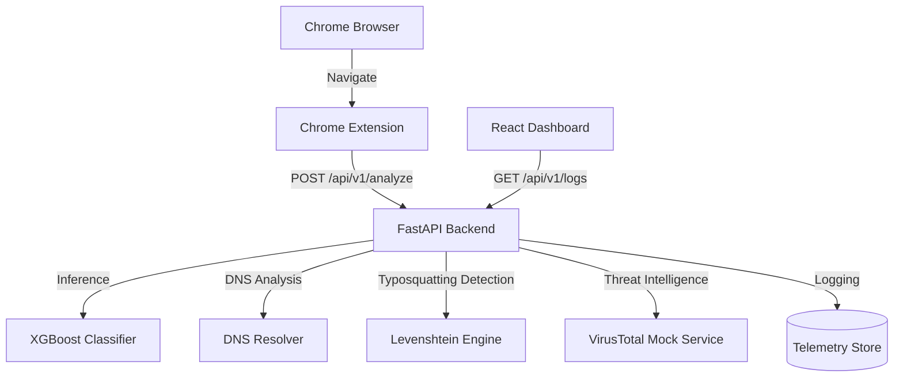

# PhishGuard: ML-Powered Phishing URL Detection System

## Overview

PhishGuard is a full-stack cybersecurity project that combines Machine Learning, Threat Intelligence, Browser Security, and SOC-style investigation workflows to detect phishing URLs in real time.

The system analyzes URLs using a trained XGBoost classifier, DNS intelligence, typosquatting detection, and simulated threat intelligence feeds to identify malicious websites before users interact with them.

---

## Key Features

* Real-time phishing URL detection
* XGBoost-based machine learning classification
* DNS activity analysis
* Typosquatting detection using Levenshtein distance
* Simulated VirusTotal-style threat intelligence integration
* Chrome browser extension protection
* React analyst dashboard with telemetry visualization
* Exportable IoC (Indicators of Compromise) reports
* REST API architecture for easy integration

---

## System Components

### 1. REST API Backend

A FastAPI service responsible for:

* URL feature extraction
* DNS resolution
* Typosquatting analysis
* Threat intelligence lookups
* Machine learning inference
* Telemetry logging

### 2. Chrome Extension

A browser extension that:

* Intercepts user navigations
* Sends URLs to the backend API
* Displays risk warnings for suspicious websites
* Provides real-time protection

### 3. Analyst Dashboard

A React-based dashboard that:

* Displays analyzed URLs
* Shows threat intelligence results
* Visualizes risk scores
* Tracks latency metrics
* Exports investigation reports

---

## System Architecture



---

## Tech Stack

### Backend

* Python 3.11+
* FastAPI
* XGBoost
* Scikit-learn
* Pandas
* NumPy
* Levenshtein

### Frontend

* React
* Vite
* Tailwind CSS

### Browser Extension

* Chrome Extension API
* Manifest V3

### Security & Threat Intelligence

* DNS Resolution
* Typosquatting Detection
* Threat Feed Simulation

---

## Machine Learning Pipeline

### Datasets Used

#### PhishTank

Verified phishing URLs used as malicious samples.

#### URLhaus

Malware distribution URLs used to improve detection capability.

#### Tranco Top 1M

Legitimate domains used to generate benign URL samples.

---

## Features Extracted

The model extracts multiple lexical URL features in real time:

* URL Length
* Dot Count
* Hyphen Count
* @ Symbol Count
* Query Parameter Count
* Double Slash Count
* Slash Count
* Equals Sign Count
* Digit Count
* Domain Length
* Suspicious Keyword Count
* IP Address Usage

Example suspicious keywords:

* login
* verify
* bank
* secure
* account
* update

---

## Model Performance

### Algorithm

XGBoost Classifier

Configuration:

```python
max_depth = 6
n_estimators = 150
```

### Evaluation Results

| Metric                | Score |
| --------------------- | ----- |
| Accuracy              | ~98%  |
| Precision (Malicious) | 99%   |
| Recall (Malicious)    | 97%   |
| Precision (Benign)    | 97%   |
| Recall (Benign)       | 99%   |

---

## Installation & Setup

### Backend Setup

Ensure Python 3.11+ is installed.

```bash
cd backend

pip install -r requirements.txt

pip install Levenshtein

python fetch_datasets.py

python train_model.py

python -m uvicorn app.main:app --host 127.0.0.1 --port 8001
```

Backend will start at:

```text
http://127.0.0.1:8001
```

---

### Dashboard Setup

Ensure Node.js is installed.

```bash
cd dashboard

npm install

npm run dev
```

Dashboard will be available at:

```text
http://localhost:5173
```

or

```text
http://localhost:5174
```

---

### Chrome Extension Setup

1. Open Chrome
2. Navigate to:

```text
chrome://extensions/
```

3. Enable Developer Mode
4. Click Load Unpacked
5. Select the extension folder

The extension will now monitor navigations and perform real-time phishing analysis.

---

## API Documentation

### Analyze URL

**Endpoint**

```http
POST /api/v1/analyze
```

### Request

```json
{
  "url": "http://fake-login-update-credentials-verify.com/update"
}
```

### Response

```json
{
  "id": 1,
  "url": "http://fake-login-update-credentials-verify.com/update",
  "risk_level": "HIGH",
  "ml_score": 0.8764,
  "typosquatting": {
    "is_typosquat": false,
    "spoofed_target": null,
    "distance": 0
  },
  "dns": {
    "dns_active": false,
    "ips": []
  },
  "virus_total": {
    "status": "flagged",
    "positives": 4,
    "total": 70
  },
  "latency_ms": 172.64,
  "timestamp": "2026-06-15 07:23:19"
}
```

---

### Fetch Logs

**Endpoint**

```http
GET /api/v1/logs
```

### Response

Returns all analyzed URLs and telemetry generated during the current session.

---

## Screenshots

### Dashboard

```text
Add screenshots/dashboard.png here
```

### Browser Warning

```text
Add screenshots/extension-warning.png here
```

---

## Future Enhancements

* Live VirusTotal API integration
* WHOIS domain age analysis
* GeoIP enrichment
* Docker deployment
* Kubernetes deployment
* SIEM integration (Splunk / ELK)
* Automated model retraining pipeline
* Real-time threat intelligence feeds

---

## Disclaimer

This project is intended for educational, research, and demonstration purposes.

Threat intelligence results currently use a simulated VirusTotal-style service and should not be considered a replacement for production-grade security tooling.

---

## Author

Developed as a cybersecurity and machine learning project demonstrating:

* Threat Detection
* Browser Security
* Machine Learning
* Threat Intelligence
* Full-Stack Development
* Security Operations Center (SOC) Workflows
